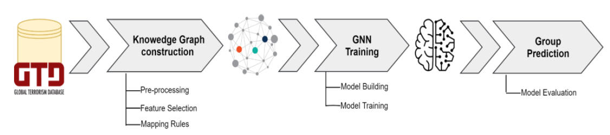

# Terrorist Organization Identification
This work treats the application of a deep learning approach for the association between attacks and perpetrator groups, which is often unknown. Identifying the most involved actors helps extract inherited features and better study attacks to implement suitable countermeasures and predict feature events. Starting from the well-known resource related to anti-terrorism operations, Global Terrorism Database (GTD), we build a knowledge graph (KG) representing entities and relationships involved
in terrorist attacks. Subsequently, we adopted the KG to train a graph neural network (GNN) to identify terrorist organizations from events using the inductive link prediction technique. The experimentation, conducted by adopting the HinSAGE framework, demonstrates promising performance in terms of accuracy with a discrete
improvement to state-of-the-art.

Methodology overview:

For more detail description refer to the uploaded paper.

## Usage
In this repository, you will find two Jupyter notebooks, each serving a specific purpose in the data analysis and link prediction process.

1) Preprocessing and Feature Analysis Notebook: This notebook is dedicated to data preprocessing and feature analysis. It includes steps to clean and prepare the data for further analysis. Additionally, it explores the dataset's characteristics and extracts relevant features to be used in the link prediction model.

2) Link Prediction Model Training Notebook: In this notebook, the data from the Knowledge Graph (KG) is retrieved, and a link prediction model is trained. The link prediction model is designed to predict potential relationships between group and event in the KG based on the extracted features from the preprocessing stage. This notebook covers model training and evaluation of the link prediction.
